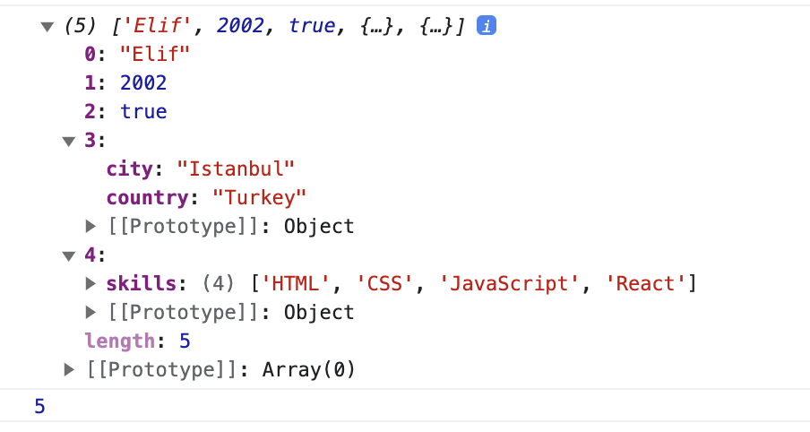

# 30-days-javascript

## 1. gun

### Giris yapildi

## 2. gun

### Veri turleri

## 3. gun

### Boolean, Operatorler ve Tarih Objesi

## 4. gun

### Donguler konusuna giris yapildi

- If
- If - Else
- If - Else If - Else
- Switch
- Ternary Operators

## 5. gun

### Diziler

**Bos dizi olusturma**
Bos dizi olusturmak icin bir cok yontem mevcuttur. Bunlardan 3 tanesini;

1. `const  arr = Array();`
2. `let arr = new Array();`
3. `const  arr = [];`
   seklindedir.

**Degerlere sahip bir dizi olusturma**

```
const numbers = [0, 3.14, 37, 98.6, 100] // sayı dizisi
const  webTechs = ['HTML', 'CSS', 'JS', 'React', 'MongDB'] // string dizisi, web teknolojileri
```

**Dizileri yazdirmak ve dizilerin uzunluklarini ogrenmek**

```
console.log('Numbers:', numbers)

console.log('Number of numbers:', numbers.length)
```

_Cikti:_

```
Numbers: [0, 3.14, 9.81, 37, 98.6, 100]

Number of numbers: 6
```

**Dizideki degerler farkli veri tiplerinde olabilir**

```
const arr4 = ["Elif",
    2002,
    true,
    { country: "Turkey", city: "Istanbul" },
    { skills: ["HTML", "CSS", "JavaScript", "React"] }
]
console.log(arr4);
console.log(arr4.length);
```

_Cikti:_


**Split kullanarak dizi olusturmak**
Split ile diziyi farkli sekillerde bolebilir ve diziyi degistirebiliriz.
Split kullanarak tek bir veri tanimladiysak yani veriyi virgullerle ayirmadiysak split ile string degerin her birini harf harf dizi olarak tanimlayacaktir.
Eger string olarak bir degisken tanimladiysak ve bu degiskenin icinde bir cok kelime virgullerle ayrilarak kullanildiysa kelime kelime olarak yeni bir diziye atar.

```
let js = "javascript";
const charsJavascript = js.split("");
console.log(charsJavascript);
```

_Cikti:_
`(10) ['j', 'a', 'v', 'a', 's', 'c', 'r', 'i', 'p', 't']`

```
let socialMedia = "Twitter,Instagram,Facebook,Google,Snapchat";
const socialMedias = socialMedia.split("");
console.log(socialMedias);
```

_Cikti:_

```
(42) ['T', 'w', 'i', 't', 't', 'e', 'r', ',', 'I', 'n', 's', 't', 'a', 'g', 'r', 'a', 'm', ',', 'F', 'a', 'c', 'e', 'b', 'o', 'o', 'k', ',', 'G', 'o', 'o', 'g', 'l', 'e', ',', 'S', 'n', 'a', 'p', 'c', 'h', 'a', 't']

```

```
const socialMedias2 = socialMedia.split(",");
console.log(socialMedias2);
```

_Cikti:_

```
(5) ['Twitter', 'Instagram', 'Facebook', 'Google', 'Snapchat']
```

```
let txt = "I love to JavaScript. I teach JavaScript, Html, Css"
const words = txt.split(" ");
console.log(words);
```

_Cikti:_
`(9) ['I', 'love', 'to', 'JavaScript.', 'I', 'teach','JavaScript,', 'Html,', 'Css']`

**Index kullanarak dizi elemanlarına ulaşmak**
index degerlerini kullanarak dizi elemanlarına ulaşabiliriz.

**Dizi elemanlarını düzenlemek**
Bir dizi degistirilebilir, yaratildiktan sonra eleman icerklerini degistirebiliriz

**Dizileri manüple edebilecek metotlar**
Baslica bu metotlar:

- Array
- length
- concat
- indexOf
- slice
- splice
- join
- toString
- includes
- lastIndexOf
- isArray
- fill
- push
- pop
- shift
- unshift

#### Array

Array:Bir dizi yaratmak için kullanılır.

#### fill ile statik degerler yaratmak

fill: Bütün dizi elemanlarını statik değerle doldurur.

#### Concat kullanarak dizileri birleştirmek

concat: İki veya daha fazla sayida diziyi birbiri ile birleştirir.

#### Length

Length:Dizi uzunluğunu bildirir.

#### indexOf

indexOf: O elemanın dizide olup olmadığını kontrol eder.Eğer o eleman dizide mevcutsa index numarasını, mevcut değilse -1 döner.
`fruits.indexOf('avocado')`
`numbers.indexOf(5)`

#### lastIndexOf

lastIndexOf: Dizideki son elemanın pozisyonunu verir. Eğer mevcutsa o elemanın index numarasını döner, mevcut değilse -1 döner.
`numbers.lastIndexOf(6)`

#### includes

includes:Bir dizide bir öğenin olup olmadığını kontrol etmek için kullanılır.Mevcut ise, true değerini döndürür, aksi takdirde false değerini döndürür.
`webTechs.includes('Node')`

**Diziyi kontrol etmek**

#### Array.isArray

Array.isArray: Veri tipinin bir dizi olup olmadığını kontrol etmek için kullanılır.
`Array.isArray(numbers)`

**Diziyi stringe çevirmek**

#### toString

toString:Diziyi string bir ifadeye çevirir.

#### join

join: Dizinin elemanlarını birleştirmek için kullanılır, join yönteminde ilettiğimiz argüman dizide birleştirilir ve bir dizi olarak döndürülür. Varsayılan olarak bir virgül ile birleşir, ancak elemanlar arasında birleştirilebilecek farklı dizi parametreleri iletebiliriz.

#### Slice

Slice: Bir aralıktaki çoklu elemanları dilimler İki parametre alır. Bu parametreler, başlangıç ve bitiş konumlarıdır. Bitiş konumunu dahil etmez.

#### Splice

Splice: üç parametre alır :başlangıç konumu, kaldırılması gereken eleman sayısı ve eklenmesi gereken eleman sayısı

#### Push kullanarak diziye eleman eklemek

Push: Dizinin sonuna eleman ekler.Varolan bir diziye eleman eklemek için push metodunu kullanırız.

#### Pop kıllanarak diziden eleman çıkarmak

Pop: Dizinin sonundaki elemanı siler.

#### Shift ile dizinin en başından eleman kaldırmak

shift: Dizinin en başındaki elemanı siler.

#### Unshift ile dizinin en başından eleman eklemek

unshift: Dizinin başına dizi elemanı ekler.

**Dizi sırasını terse çevirmek**

#### Reverse

reverse: Dizi sıralamasını terse çevirir.

**Dizi elemanlarını sıralamak**

#### Sort

sort: Dizi elemanlarını alfabetik sırada düzenleyin.Sort call back fonksyonu alır, sort'un call back fonksiyonu ile nasıl kullandığımızı ilerleyen bölümlerde göreceğiz.

## 6. gun

### Donguler

Tekrar eden görevleri gerçekleştirmek için programlama dillerinde farklı döngü türleri kullanırız.

#### for Loop

#### while Loop

while anahtar kelimesinin yanında belirtilen şarta doğru olduğu sürece çalışan bir döngü türüdür. Eğer koşul sürekli doğru çıkacak şekilde ayarlanırsa while döngüsü uygulama kasten kesilmediği sürece sonsuza kadar devam edebilir. Bu yüzden buraya dikkat etmek gerekebilir.

#### do while Loop

do while döngüsü Koşul ile belirtilen alanın doğru olup olmadığına bakmadan kod bloğunu bir kez çalıştırır ve daha sonra Koşul ile belirtilen alan doğru (true) olduğu sürece kod bloğunun çalışması için kullanılır.

#### for of loop

for..of Deyimi, yinelenen nesneler üzerinde yinelemek için bir döngü oluşturur. ES6'da tanıtılan for..of döngü , yeni yinelemeli protokollerin yerini alır. for..in ve forEach() destekler. for..of Array (Diziler), String (Metinler), Map (Haritalar), Set (Kümeler), Array benzeri nesneler (örneğin arguments veya NodeList), ve diğer yinelenen veri yapıları arasında yineleme yapmanızı sağlar.

#### break

Break, bir döngüyü kesmek için kullanılır.

#### continue

Belirli bir döngü aşamasını atlamak için continue anahtar kelimesi kullanılır.

## 7. gun

### Fonksiyonlar

Bir fonksiyon, belirli bir görevi gerçekleştirmek üzere tasarlanmış ve yeniden kullanılabilir bir kod bloğu veya programlama tanımıdır.

Bir fonksiyon, function anahtar kelimesi ardından gelen o fonksiyona ait fonksiyon ismi ve parantezler ile tanımlanır. Bu paranteler fonksiyona parametre atayabilmemizi sağlar. Şayet fonksiyon parametre alırsa bu parametre fonksiyon scope'u içerisinde geçerli olan bir değişkendir. Farklı bir kullanım olarak da bu parametreye default değerler atayabiliriz. Eğer bir fonksiyon yardımı ile veri taşımak istiyorsak söz konusu fonksiyonun belirli bir veri türünü geriye değişken olarak döndürmesi gerekir. Daha sonra dönen bu değişkeni bir başka değişkene atayarak kullanabilir.

Fonksiyon kullanmanın avantajları:

- temiz ve okunması kolay
- yeniden kullanılabilir
- kolay test edilir

Bir fonksiyon birkaç şekilde tanımlanabilir:

1. Klasik Declaration function
2. Expression function
3. Anonymous function
4. Arrow function

#### 1- Klasik Fonksiyon Tanımlama

```
//parametresiz fonksiyon tanımıı
function functionName() {
  // istenilen kod parçası
}
functionName() // fonksiyon, fonksiyon adı ve parantezler ile çağırılır
```

#### Anonymous Function - İsimsiz Fonksiyon

```
const anonymousFun = function() {
console.log(
'İsimsiz bir fonksiyonum ve değerim anonim olarak saklanıyor'
)
}
```

#### 2- Expression Function

Expression function, isimsiz fonksiyonlardır. İsimsiz bir fonksiyon oluşturduktan sonra bir değişkene atayarak kullanırız. Fonksiyondan bir değer geri döndürmek için değişkeni çağırmalıyız.

```
// Function expression
const square = function() {
  console.log("Bu bir expression function türünde fonksiyondur")
}
```

#### Parametresiz ve dönüş değeri olamayan fonksiyon

Fonksiyon, parametre olmadan tanımlanabilir.

#### Bir değer döndüren fonksiyon

Fonksiyonlar geriye bir değer döndürebilir. bu işlemi return anahtar kelimesini kullanarak sağlarız. Normal fonksiyondan farklı olarak bir field'a atanabilir veya bir metot içerisinde parametre olarak kullanılabilir.

#### Parametreli Fonksiyonlar

Bir fonksiyonda farklı veri türlerini (number, string, boolean, object, function) parametre olarak geçebiliriz.

#### Sınırsız sayıda parametreyle çalışan fonksiyon

Fonksiyonlarla çalışırken kaç tane parametre gerekebileceğini bilemeyebiliriz. Javascript'te bu durumda bize sınırsız sayıda parametre alan fonksiyon yazabilme imkanı tanır. Bu şekilde bir fonksiyon tanımlamanın iki yolu vardır.

#### Klasik fonksiyonda sınırsız sayıda parametre

Bu fonksiyonun tanımlanmasını fonksiyon scope'nda object temelli arguments anahtar kelimesi ile erişilir. Parametre olarak atanan her öğeye arguments üzerinden ulaşabiliriz.

##### Arrow function

Klasik fonksiyona alternatif olarak kullanılan arrow function sözdiziminde ufak bir farklılık vardır. function anahtar kelimesi yerine => işareti kullanılır.

#### Arrow function'da sınırsız sayıda parametre

Arrow function, klasik fonksiyon gibi arguments nesnesine sahip değildir. Arrow function'da sınırsız sayıda parametre kullanmak istersek spread operatör (...) ve hemen ardından parametre adı kullanılır. Fonksiyonda bağımsız değişken olarak geçtiğimiz her şeye arrow functionda dizi olarak erişilebilir. Bir örnek görelim

```
// arguments nesnesine erişmemize bir örnek
​
const sumAllNums = (...args) => {
 // console.log(arguments), arguments nesnesi bulunamadı
 // bunun yerine spread operator (...) ve parametre adı kullanalım
 console.log(args)
}

sumAllNums(1, 2, 3, 4)
// [1, 2, 3, 4]
```

#### Default parametre ile fonksiyon kullanımı

Bazen parametrelere default değerler geçmek isteyebiliriz. Bu durumda fonksiyon çağırımı sırasında söz konusu parametreyi vermek zorunda olmadan kullanabiliriz. Eğer bu parametreyi vermezsek fonksiyon işlevinin parametrenin default değerini kullanarak tamamlayacaktır.

```
// syntax - söz dizimi
// fonksiyon tanımı
function functionName(param = value) {
  //codes
}

// fonksiyon çağırımı
functionName()
functionName(arg)
```

## 8. Gun

### Scope - Kapsam Kavramlari

- Global Scope
- Local Scope

var, let veya const olmadan tanımlanan her değişken global scope olarak geçerlidir.

#### Global scope

Aynı dosyanın her yerinde global olarak tanımlanan bir değişkene erişilebilir. Global olma durumu iki şekilde olabilir Dosyanın direkt kendisinde global olabilir veya bazı kod bloklarına göre global olabilir.

#### Local scope

Yerel olarak tanımlanan bir değişkene yalnızca belirli kod bloğunda erişilebilir.

- Block Scope
- Function Scope

* var anahtar kelimesi ile tanımlanan bir değişken fonksiyon scope'u içerisinde geçerlidir. Ancak let veya const anahtar kelimeleri ile tanımlanan değişkenler block scope'unda geçerlidir. (fonksiyon, if veya diğer dönggü blokları). Block kapsamını biraz daha netleştirmek gerekirse Javascript ve diğer çoğu yazılım dili için süslü parantezler arası demek olur.

* const ile tanımlanan bir değişkenin değerini daha sonraki satırlarda değiştiremeyiz ancak let ile tanımlanan değişkenin değerini değiştirebiliriz. Ben let ve const kullanarak temiz kod yazmanızı ve hata ayıklamanın zor olmasını önlemek için let ve const 'ı kullanmanızı tavsiye ederim. Temel kural olarak, herhangi bir sabit değer için let ve dizi, nesne, ok fonksiyonu ve işlev ifadesi için const özelliğini kullanabilirsiniz.

### Object - Nesne
